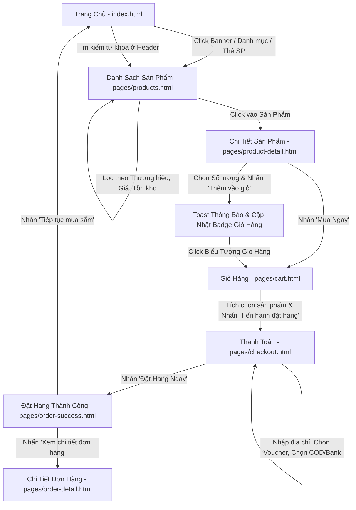
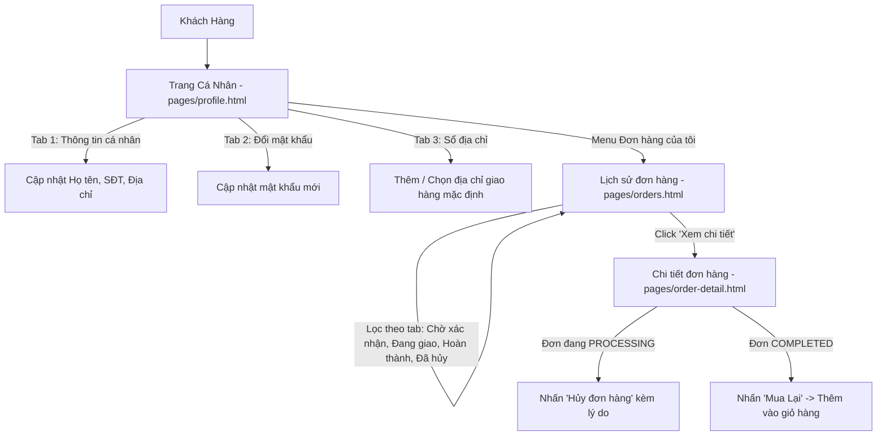
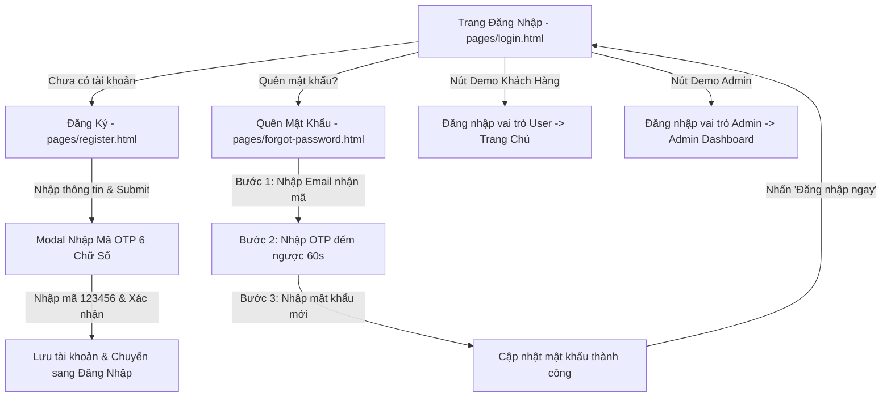
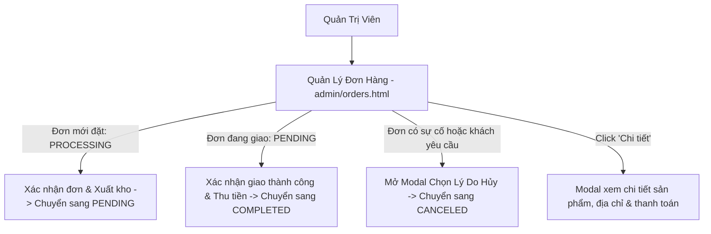
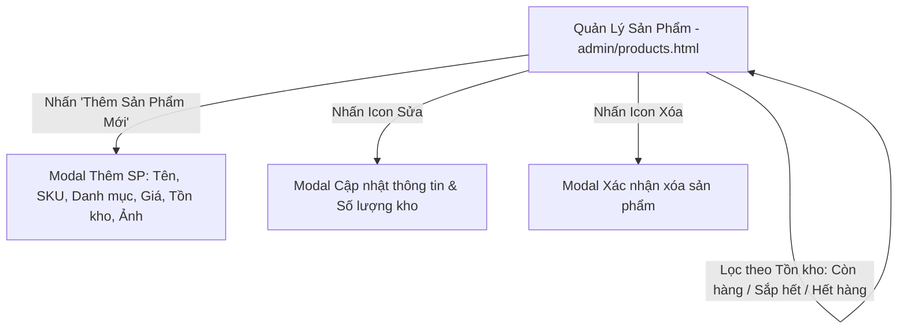
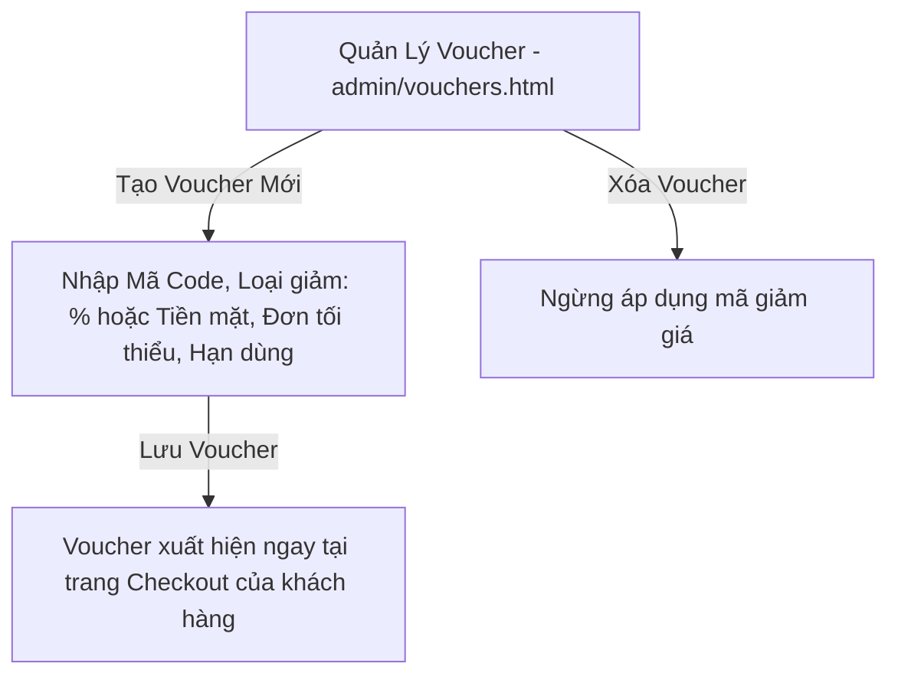
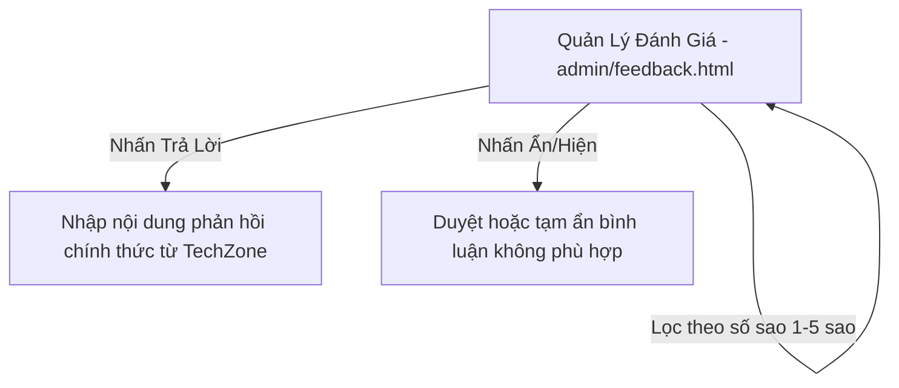

# Sơ Đồ Điều Hướng & Luồng Người Dùng (UI/UX Flow) - TechZone

Tài liệu này mô tả chi tiết cây điều hướng toàn bộ hệ thống (Sitemap), các luồng nghiệp vụ người dùng (User Flows) và sơ đồ tương tác giữa các trang trong bộ Prototype tĩnh TechZone.

---

## 1. Cây Điều Hướng Toàn Hệ Thống (Sitemap & Page Map)

```text
TechZone Static Prototype Root
│
├── index.html (Trang chủ & Khám phá sản phẩm)
│
├── pages/
│   ├── products.html (Danh mục, Tìm kiếm & Bộ lọc Faceted Filter)
│   ├── product-detail.html (Chi tiết sản phẩm, Thông số & Đánh giá)
│   ├── cart.html (Giỏ hàng, Chọn sản phẩm & Tính tiền)
│   ├── checkout.html (Thanh toán, Chọn địa chỉ & Voucher)
│   ├── order-success.html (Xác nhận đặt hàng thành công)
│   ├── orders.html (Lịch sử đơn mua & Phân loại trạng thái)
│   ├── order-detail.html (Chi tiết đơn hàng & Stepper tiến trình)
│   ├── login.html (Đăng nhập & Chuyển đổi tài khoản demo)
│   ├── register.html (Đăng ký tài khoản mới & Mô phỏng mã OTP)
│   ├── forgot-password.html (Khôi phục mật khẩu 3 bước OTP)
│   └── profile.html (Hồ sơ cá nhân, Đổi mật khẩu & Sổ địa chỉ)
│
└── admin/
    ├── dashboard.html (Tổng quan kinh doanh, KPI & Tỷ trọng danh mục)
    ├── products.html (Quản lý kho sản phẩm, Thêm/Sửa/Xóa sản phẩm)
    ├── orders.html (Quản lý đơn hàng, Chuyển trạng thái & Hủy đơn)
    ├── vouchers.html (Quản lý mã giảm giá & Hạn mức áp dụng)
    ├── users.html (Quản trị tài khoản & Phân quyền hệ thống)
    └── feedback.html (Kiểm duyệt đánh giá & Trả lời bình luận khách hàng)
```

---

## 2. Luồng Nghiệp Vụ Khách Hàng (Customer User Flows)

### 2.1. Luồng Khám Phá Sản Phẩm & Mua Hàng (Conversion Funnel)



### 2.2. Luồng Quản Lý Tài Khoản & Lịch Sử Mua Hàng



### 2.3. Luồng Xác Thực & Khôi Phục Mật Khẩu



---

## 3. Luồng Nghiệp Vụ Quản Trị Viên (Admin Workflows)

### 3.1. Luồng Xử Lý Đơn Hàng & Giao Nhận



### 3.2. Luồng Quản Lý Tồn Kho & Sản Phẩm



### 3.3. Luồng Quản Lý Khuyến Mãi (Vouchers)



### 3.4. Luồng Kiểm Duyệt Đánh Giá (Feedback Moderation)



---

## 4. Nguyên Tắc Điều Hướng Tương Đối (Relative Paths)

Tất cả các liên kết trong toàn bộ prototype đều tuân thủ 100% đường dẫn tương đối (Relative Paths) để đảm bảo có thể chạy trực tiếp trên:
- **Tập tin cục bộ (File System)**: Mở trực tiếp `index.html` bằng trình duyệt.
- **Visual Studio Code Live Server**: `http://127.0.0.1:5500/index.html`.
- **GitHub Pages**: `https://<username>.github.io/<repo-name>/index.html`.

### Bảng Quy Ước Đường Dẫn:

| Vị trí file nguồn | Đích đến | Cú pháp đường dẫn |
| :--- | :--- | :--- |
| `index.html` | Trang con trong `pages/` | `pages/products.html`, `pages/cart.html` |
| `index.html` | Trang quản trị `admin/` | `admin/dashboard.html` |
| `index.html` | Tài nguyên CSS/JS/Images | `css/style.css`, `js/data.js`, `assets/images/...` |
| `pages/*.html` | Về Trang chủ | `../index.html` |
| `pages/*.html` | Sang trang con khác cùng thư mục | `cart.html`, `checkout.html`, `login.html` |
| `pages/*.html` | Sang trang quản trị `admin/` | `../admin/dashboard.html` |
| `pages/*.html` | Tài nguyên CSS/JS/Images | `../css/style.css`, `../js/data.js`, `../assets/images/...` |
| `admin/*.html` | Về Cửa hàng (Trang chủ) | `../index.html` |
| `admin/*.html` | Sang trang quản trị khác | `products.html`, `orders.html`, `vouchers.html` |
| `admin/*.html` | Tài nguyên CSS/JS/Images | `../css/style.css`, `../js/data.js`, `../assets/images/...` |
